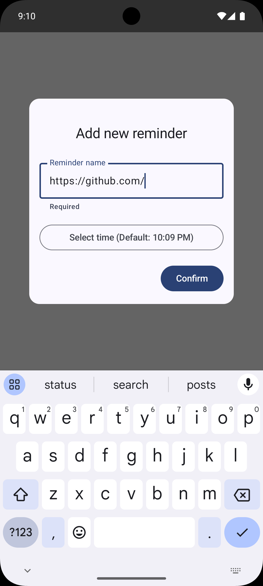
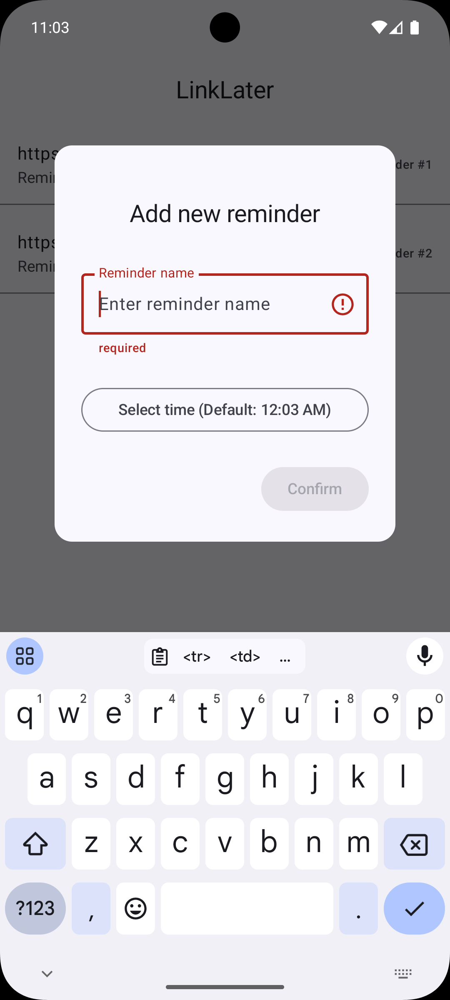
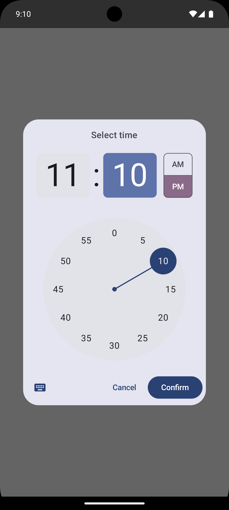
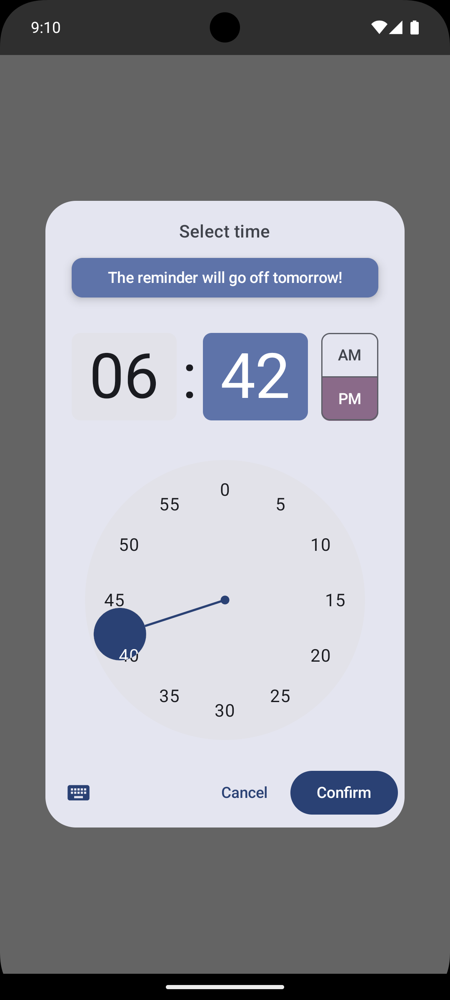
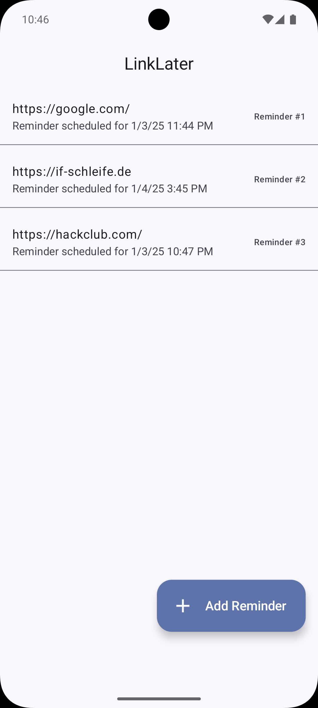
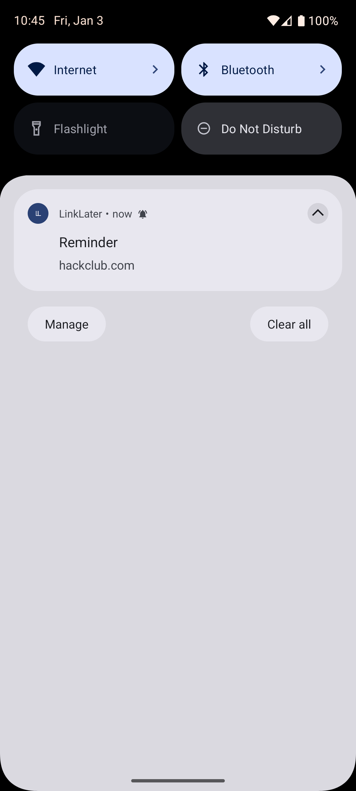

# LinkLater

  

## Download

Install this app from one of the following sources:

- [Github](https://github.com/CookieDude24/LinkLater/releases/download/1.0/LinkLater-1.0.apk)

## Features

- Set reminders (only text)
- Set reminders in Android Share Menu or in the apps
- When the reminders content is a Link, clicking on the notification will automatically open it in the associated app or
  a browser

## Usage

I envisioned the following use case:

See a social media post in feed that you want to watch but currently can't. Share this post to LinkLater via the android
Share Menu and the app reminds you of the poster at a later point in time.

## Screenshots

<table>
  <tr>
    <td>
    
    </td>
    <td>
    
    </td>
  </tr>
  <tr>
    <td>
    
    </td>
    <td>
    
    </td>
  </tr>
  <tr>
    <td>
    
    </td>
    <td>
    
    </td>
  </tr>
</table>

